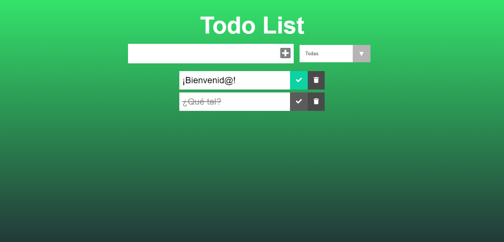

## To-do List de Hannah Carabolante

#### Este proyecto es una aplicación descargable, desarrollada con REACT y PWA. Fue realizada con el fin de su evaluación a partir de lo aprendido en el séptimo módulo de la sexta generación de FRONTEND de [ADA](https://adaitw.org/).

<br>


***

### Si quiere echarle un vistazo puede darle click a este [enlace](https://mystifying-varahamihira-8ccb94.netlify.app/).

<br>


***

### Si quiere tener el código en su computadora, deberá de seguir estos pasos en su terminal.

- Ir al [repositorio](https://github.com/carabolanteh/portafolio).
- Darle click al botón de forkear.
- Darle click al botón de code color verde.
- Copiar la url.
- Abrir su terminal y poner el comando de  ```git clone <url>```.
- Entrar a la carpeta del proyecto y abrirlo en tu IDE.

### Este proyecto requiere la instalación la dependencia de 'firebase'.

<br>

***

### A continuación, le dejo una imagen ilustrativa de como debería de verse el proyecto en su navegador.

<br>




<br>

***

<br>

### Este portafolio no sería lo que es sin la ayuda de [Jonh](https://github.com/Jonhks), Leydy y mis compañeras de curso. No me queda más que agradecerles. 🥰

<br>

***

#### De Hannah, con mucho ❤ ¡para ustedes!